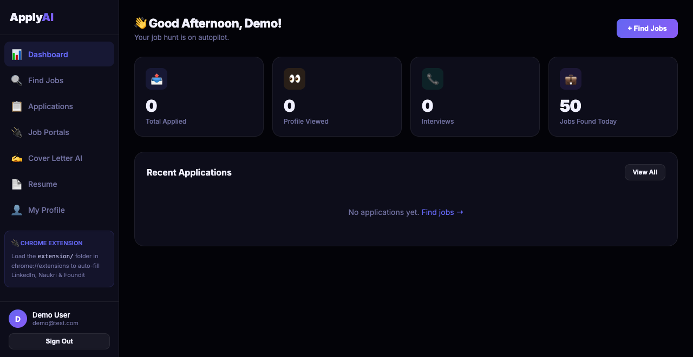
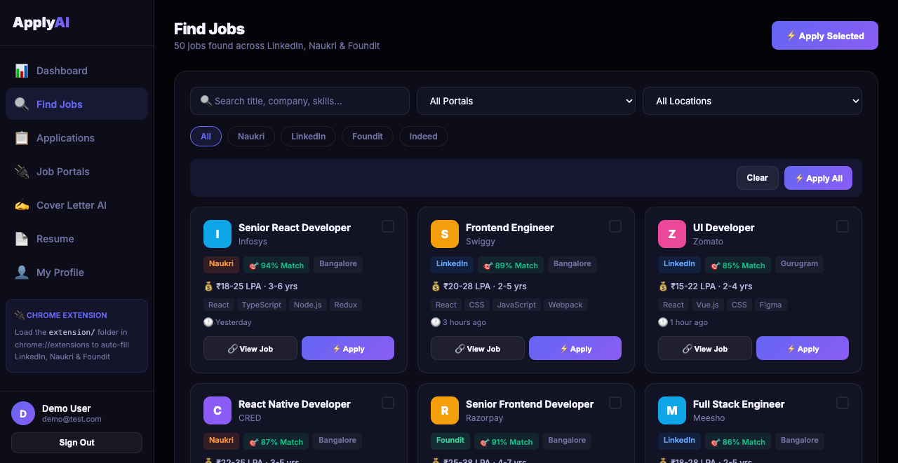
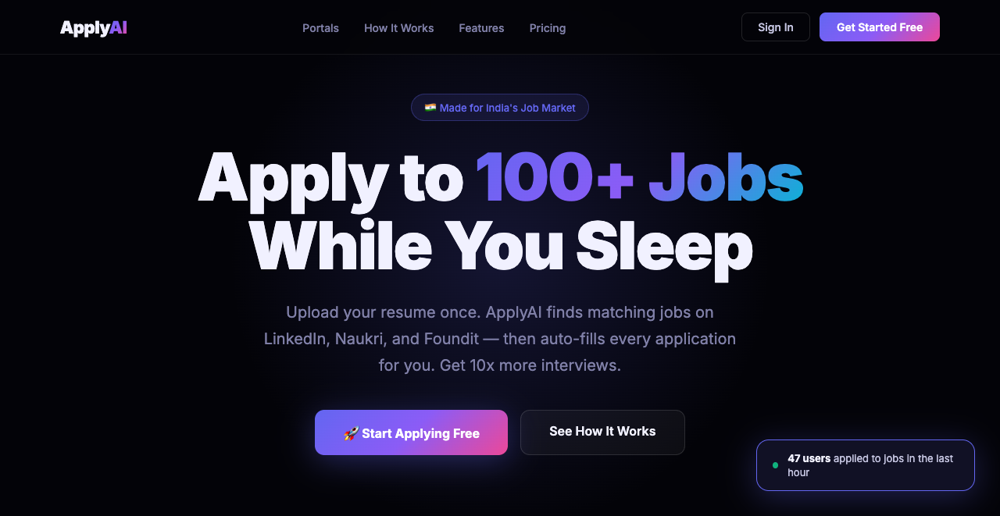
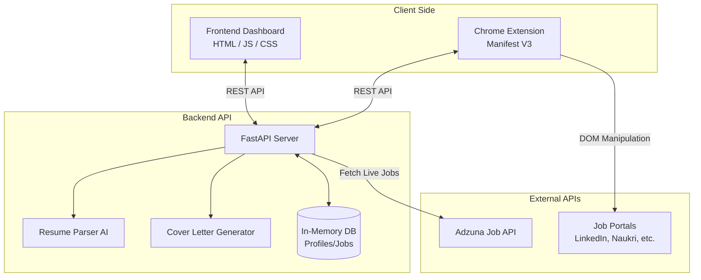
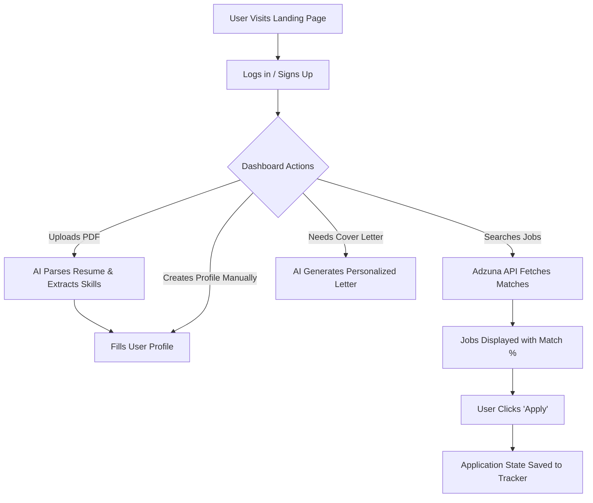
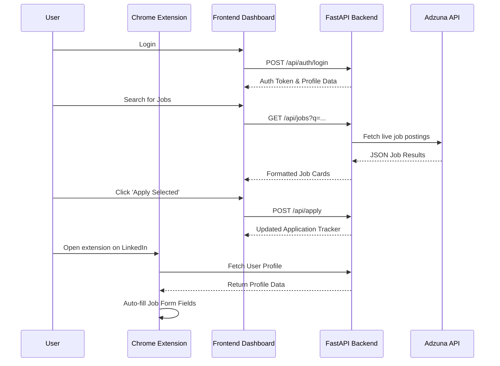

# ApplyAI — Job Application Automation SaaS (Prototype)



### 🔍 Find Jobs View


### 🗂️ Landing Page View


ApplyAI is a full-stack job application automation prototype designed for the Indian job market. It includes a FastAPI backend, a responsive frontend dashboard, and a companion Chrome Extension to streamline the job search and application process.

## 🚀 Features

### 🟢 Fully Functional
*   **Adzuna API Integration:** Connects to the real-world Adzuna Job API to fetch live job listings.
*   **Smart Deep Links:** Dynamically generates accurate, pre-filtered search URLs for LinkedIn, Naukri, Indeed, and Foundit.
*   **Automated Cover Letters:** Generates personalized cover letters based on user skills, experience, and the specific job title.
*   **Chrome Extension UI:** A fully functional extension popup and content script architecture ready to be injected into job portals.
*   **Responsive Dashboard:** A polished, modern web interface.

### 🟡 Mocked for Demo Purposes
*To keep this repository lightweight and easy to run locally, the following features are simulated:*
*   **Database:** Uses an in-memory datastore (clears on restart) instead of a heavy PostgreSQL/MongoDB setup.
*   **Auto-Apply:** Simulates the application pipeline and status updates (Viewed, Shortlisted) without requiring actual bot logins/automation via Playwright.
*   **Resume Parsing:** Simulates skill extraction rather than using heavy OCR libraries.

## 💻 Tech Stack
*   **Backend:** Python, FastAPI, Uvicorn
*   **Frontend:** Vanilla JavaScript, HTML5, CSS3, Tailwind (or custom CSS)
*   **Browser Extension:** Chrome Manifest V3, JavaScript

## 🏗️ Architecture & Flow Diagrams

### 1. High-Level Architecture


### 2. User Journey Flow


### 3. Application Sequence Diagram


## 🛠️ How to Run Locally

### 1. Start the Backend
Make sure you have Python installed, then run:

```bash
# Install required packages
pip install fastapi uvicorn pydantic httpx python-multipart

# Start the server
cd backend
python main.py
```
*The server will start on `http://localhost:8000`*

### 2. Load the Chrome Extension
1. Open Chrome and navigate to `chrome://extensions/`
2. Enable **Developer mode** in the top right corner.
3. Click **Load unpacked**.
4. Select the `extension/` folder from this repository.

### 3. (Optional) Enable Live Data
To fetch real jobs instead of the demo dataset, set your Adzuna API credentials in your environment variables before starting the backend:
```bash
export ADZUNA_APP_ID="your_app_id"
export ADZUNA_APP_KEY="your_app_key"
```

## ⚖️ Disclaimer & Privacy

**Disclaimer:** This project is a **prototype/portfolio project** intended for educational and demonstration purposes only. It is not currently a production-ready application. 
* All database interactions are mocked using in-memory structures and run completely locally on your machine.
* The "Auto-Apply" feature is a simulation of the UI/UX pipeline and does not currently log into your job portal accounts or submit applications on your behalf.
* The creators hold no liability for any issues arising from the use of this code, or any attempts to modify it to interact with third-party job boards against their Terms of Service.

**Privacy:** 
* No personal data, resumes, or application metrics are stored on any external server. 
* All data entered into this platform remains on your local machine (`http://localhost:8000`) and is wiped whenever the backend server is restarted. 

## 🤝 Contributing & Permissions
This is an open-source prototype. You are granted full permission to download, modify, fork, and use this codebase for your own educational purposes or to build upon it. 

If you wish to integrate a real database, or build out the Playwright/Selenium automation scripts for the `auto-apply` feature, feel free to submit a Pull Request!

## 📬 Contact the Developer
Designed and developed by **Jaikesh Singh**.
If you have questions, feedback, or would like to discuss this project, feel free to reach out:
* **Email:** [jaikeshsingh@gmail.com](mailto:jaikeshsingh@gmail.com)

## 📜 License
[MIT License](LICENSE)
